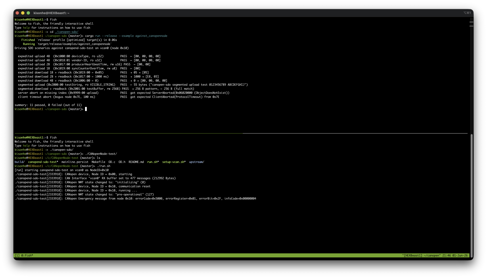

# canopen-sdo

Sans-IO CANopen SDO client (CiA 301) — supports expedited and
segmented transfers, server / client / timeout aborts.

The protocol state machine has **zero IO and zero async** in it. You
feed it CAN frames, it tells you which frames to send next and when to
fire a timeout. This makes it trivial to unit-test, easy to port
across runtimes (tokio, embassy, blocking), and tiny to embed.

An optional tokio + [`can-transport`](https://crates.io/crates/can-transport) glue layer is
shipped behind the `tokio` feature (enabled by default) so the common
case stays a one-liner.

## Quick start — async (tokio + SocketCAN)

```toml
[dependencies]
canopen-sdo = "0.1"
can-transport = { version = "0.1", features = ["socketcan"] }
tokio = { version = "1", features = ["full"] }
```

```rust
use std::time::Duration;
use can_transport::socketcan::SocketCanBus;
use canopen_sdo::asynch::{upload_bytes, download_bytes};

#[tokio::main]
async fn main() -> anyhow::Result<()> {
    let bus = SocketCanBus::open("can0")?;
    let node = 0x10;
    let timeout = Some(Duration::from_millis(200));

    // Read 0x1008:00 (manufacturer device name, segmented string)
    let name = upload_bytes(&bus, node, 0x1008, 0x00, timeout).await?;
    println!("device name: {}", String::from_utf8_lossy(&name));

    // Write control word
    download_bytes(&bus, node, 0x6040, 0x00, &[0x06, 0x00], timeout).await?;
    Ok(())
}
```

You can hand `upload_bytes` any type implementing
`can_transport::CanBus`, so swapping SocketCAN for PCAN, embassy-CAN,
a serial-CAN bridge, or an in-memory loopback (for tests) requires zero
changes to the SDO code.

### Off Linux (or driverless CAN-FD): gs_usb / candleLight

To run against a gs_usb adapter — on Windows, macOS, or Linux without the
kernel driver — enable `can-transport`'s `gs_usb` feature and open a
`GsUsbBus` instead; the SDO calls are identical:

```rust
use can_transport::gs_usb::{GsUsbBus, GsUsbConfig};
let bus = GsUsbBus::open(GsUsbConfig::fd_1m_5m()).await?; // 1 Mbit / 5 Mbit FD
let name = upload_bytes(&bus, node, 0x1008, 0x00, timeout).await?;
```

See `examples/sdo_gs_usb.rs` for a runnable Identity-object (0x1018) read,
and the `can-transport` README for the per-platform driver story.

## Sans-IO usage (any runtime, no_std-friendly aside from `Vec<u8>`)

If you don't want the tokio glue, drive the state machine yourself:

```rust
use std::time::Instant;
use canopen_sdo::{SdoClient, SdoConfig, SdoOutcome, SdoFrame};

let mut client = SdoClient::new(SdoConfig::default());
client.begin_upload(0x10, 0x1008, 0x00, Instant::now())?;

loop {
    // 1) Drain anything that wants to go out on the wire
    while let Some(out_frame) = client.poll_transmit() {
        my_can_send(out_frame.cob_id, out_frame.data);
    }

    // 2) Block on either an incoming frame or the next deadline
    let next_deadline = client.poll_timeout();
    match my_wait_for_frame_or_deadline(next_deadline) {
        WokeBy::Frame(cob_id, data) => {
            let frame = SdoFrame::new(cob_id, data);
            if let Some(SdoOutcome::UploadCompleted(bytes)) =
                client.handle_frame(frame, Instant::now())?
            {
                return Ok(bytes);
            }
        }
        WokeBy::Timeout => {
            client.handle_timeout(Instant::now())?;
            // an abort frame is now sitting in poll_transmit()
        }
    }
}
```

Disable the `tokio` feature to compile without any async dependency:

```toml
canopen-sdo = { version = "0.1", default-features = false }
```

## Live-bus tests against CANopenNode



In addition to the in-process unit tests in `src/`, this repo ships a
small end-to-end harness that drives the client against a real
[CANopenNode](https://github.com/CANopenNode/CANopenNode) SDO server
running on a Linux `vcan` interface. It covers expedited and segmented
uploads/downloads, server aborts and client timeouts.

See [`CANopenNode-test/README.md`](CANopenNode-test/README.md) for
build/run instructions. In short:

```text
# one terminal: build & run the C server (uses CANopenLinux + a custom OD)
cd CANopenNode-test
./setup-vcan.sh && make && ./run.sh

# another terminal: drive every SDO scenario from Rust
cargo run --example against_canopennode -- vcan0 0x10
```

## Design notes

- **One transfer at a time per `SdoClient`.** Starting another while
  one is in flight returns `SdoError::Busy`. For parallel transfers to
  multiple nodes, create one client per node and drive them in
  separate tasks; they don't share any state.
- **No NMT handling.** The client doesn't care about NMT state. If the
  remote node isn't `Operational`/`Pre-Operational`, you'll just get
  timeout aborts.
- **Time is `std::time::Instant`.** Embedded users without an
  `Instant` source can wrap their own monotonic source in a thin shim
  for now; a generic timekeeping abstraction is on the roadmap.
- **Block transfer is not implemented.** Block mode is rare in
  practice; PR welcome.

## License

MIT OR Apache-2.0
